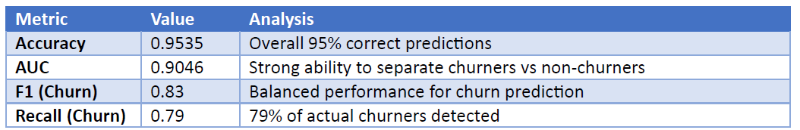
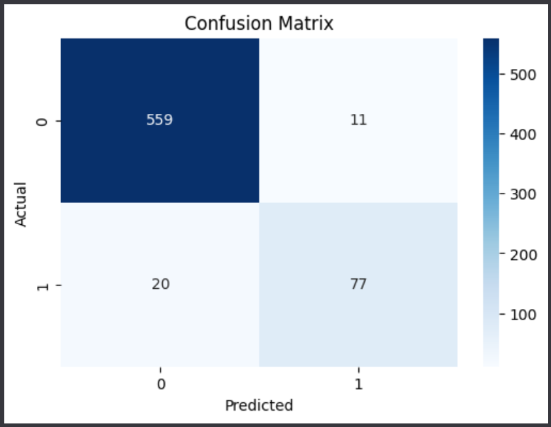
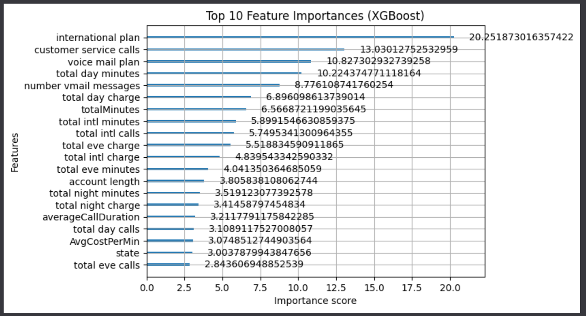

# DataAnalysis - Telecommunication Company Customer Churn

# Introduction 

- This project aims to predict customer churn using historical telecommunication usage data. The objective is to develop a predictive machine learning model that accurately identifies customers likely to churn, and to uncover key factors influencing churn behaviour.

- Early identification of customers at risk of leaving allows the company to design targeted retention campaigns and reduce revenue loss.

# Model Selection

XGBoost (Extreme Gradient Boosting) optimized machine learning library that uses an advanced form of gradient boosting to solve supervised learning problems like classification and regression. This was employed over other predictive machine learning models such as Random Forest due to its robustness, ability to handle mixed data types, and effectiveness with imbalanced classification tasks.

# Model Results

As depicted in the table below, the XGBoost churn prediction model delivers strong and reliable performance for business application:
- An Accuracy of 95.35%, the model correctly predicts the majority of customer outcomes.

- The AUC score of 0.9046 highlights its strong ability to distinguish between customers likely to churn and those who will remain.
- An F1-score of 0.83 indicates that the model achieves a good balance between identifying churners and avoiding false alarms.
- A recall rate of 0.79 shows that it successfully detects nearly 80% of customers at risk of leaving. These results suggest that the model can be effectively used to prioritize at-risk customers for targeted retention campaigns, helping the business reduce customer attrition.

 

 

## Confusion Matrix
The confusion matrix demonstrates that the churn prediction model performs strongly in identifying customer loyalty and potential churn risk. Out of all test cases, 559 customers were correctly identified as non-churners, and only 11 were incorrectly flagged as likely to churn — indicating excellent reliability in recognising customers who will stay. The model also correctly detected 77 churners, with 20 missed cases.
These results suggest the model provides a high level of confidence for retention and loyalty programs.

 

 

## Key Features
The XGBoost model identified several key factors that most strongly influence customer churn:
1. International Plan emerged as the most significant predictor of churn. Customers with international plans are substantially more likely to leave, potentially due to higher costs of international usage.
2. Customer Service Calls ranked second, reinforcing that frequent service interactions are a strong indicator of dissatisfaction. This aligns with the insight that unresolved issues drive churn.

 

 

# Insights, Predictive Indicators and Recommendations

1. <b> International Plan Customers Are the Highest-Risk Segment </b>

<b> Indicator: </b> The model identified “international plan” as the single most influential factor driving churn.
Customers subscribed to international plans appear significantly more likely to leave, suggesting potential dissatisfaction with international call pricing or perceived value.

<b> Recommendation: </b> This presents an actionable opportunity for the business to review and redesign international plans, improve transparency around costs, and introduce loyalty incentives or bundle offers for these customers. Targeted retention campaigns focusing on this high-risk group could substantially reduce overall churn.

2. <b> Frequent Customer Service Callers Indicate Unresolved Issues </b>

<b> Indicator: </b> The second most important predictor, “customer service calls,” highlights that customers who contact support multiple times are strong churn indicators. This pattern suggests underlying frustration, possibly from billing disputes, technical issues, or unmet expectations.

<b> Recommendation: </b> Operationally, this insight points to a need for enhanced service quality monitoring—for example, flagging accounts with repeated service interactions for proactive outreach. Implementing early-warning systems to identify and address these customers’ pain points could prevent churn before it occurs.

